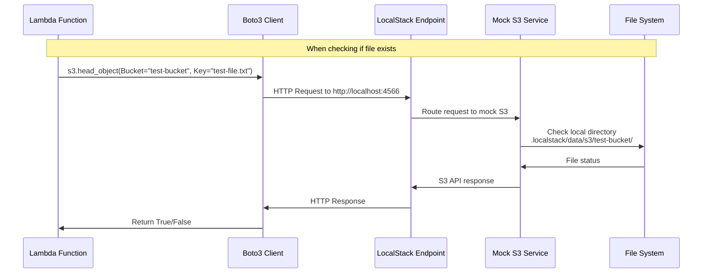
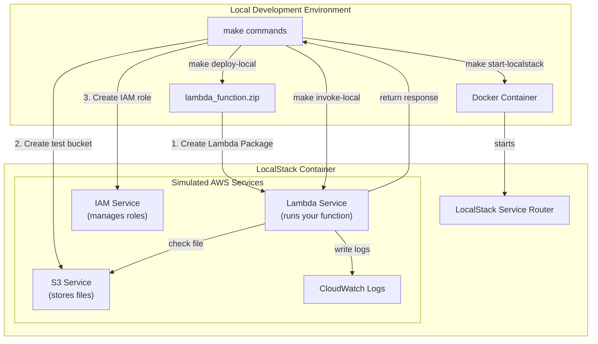

# LocalStack Development Guide

This guide explains how LocalStack simulates AWS services in your local development environment.

## Environment Setup

When your Lambda function runs in LocalStack, the following environment variables are automatically set:

```python
os.environ['AWS_ACCESS_KEY_ID'] = 'test'
os.environ['AWS_SECRET_ACCESS_KEY'] = 'test'
os.environ['AWS_ENDPOINT_URL'] = 'http://localhost:4566'
```

## Using AWS Services Locally

LocalStack intercepts AWS SDK calls and routes them to local implementations. Here's a basic example using S3:

```python
# Initialize S3 client
s3 = boto3.client('s3')

# Make API calls as usual
s3.head_object(Bucket="test-bucket", Key="test-file.txt")
```

## How LocalStack Works

### Local File Storage
LocalStack maintains a local directory structure to simulate S3:

```
.localstack/
  data/
    s3/
      test-bucket/
        test-file.txt
```

### Request Flow
When your Lambda makes an S3 request:
1. The request is sent to `http://localhost:4566` (LocalStack endpoint)
2. LocalStack's mock S3 service checks the local directory
3. Responses match the AWS S3 API format

```bash
make invoke-local       
Invoking Lambda function...
awslocal lambda invoke \
                --function-name test-lambda \
                --payload '{"bucket": "test-bucket", "file_key": "test-file.txt"}' \
                --log-type Tail \
                output.json > lambda_response.json

Function response:
{"statusCode": 200, "headers": {"Content-Type": "application/json"}, "body": "{\"file_exists\": true, \"bucket\": \"test-bucket\", \"file_key\": \"test-file.txt\"}"}
Function logs:
START RequestId: 6b1e282c-52fd-4812-ac9d-d4203974d707 Version: $LATEST
[INFO]  2025-02-24T04:21:39.319Z        6b1e282c-52fd-4812-ac9d-d4203974d707    Received event: {"bucket": "test-bucket", "file_key": "test-file.txt"}
[INFO]  2025-02-24T04:21:39.320Z        6b1e282c-52fd-4812-ac9d-d4203974d707    Processing request for bucket=test-bucket, key=test-file.txt
[INFO]  2025-02-24T04:21:39.320Z        6b1e282c-52fd-4812-ac9d-d4203974d707    Checking file existence: bucket=test-bucket, key=test-file.txt
[INFO]  2025-02-24T04:21:39.334Z        6b1e282c-52fd-4812-ac9d-d4203974d707    Found credentials in environment variables.
[INFO]  2025-02-24T04:21:39.560Z        6b1e282c-52fd-4812-ac9d-d4203974d707    Found endpoint for s3 via: environment_global.
[INFO]  2025-02-24T04:21:39.575Z        6b1e282c-52fd-4812-ac9d-d4203974d707    File exists
[INFO]  2025-02-24T04:21:39.576Z        6b1e282c-52fd-4812-ac9d-d4203974d707    Returning response: {"statusCode": 200, "headers": {"Content-Type": "application/json"}, "body": "{\"file_exists\": true, \"bucket\": \"test-bucket\", \"file_key\": \"test-file.txt\"}"}
END RequestId: 6b1e282c-52fd-4812-ac9d-d4203974d707
REPORT RequestId: 6b1e282c-52fd-4812-ac9d-d4203974d707  Duration: 257.86 ms     Billed Duration: 258 ms Memory Size: 128 MB     Max Memory Used: 128 MB 


```


### Request Flow Diagram



## Development Commands

### `make start-localstack`
- Starts a Docker container running LocalStack
- Provides mock implementations of AWS services
- Sets up endpoints for Lambda, S3, IAM, and CloudWatch Logs
- Intercepts and handles all AWS service calls locally

### `make deploy-local`
- Creates a ZIP package of your Lambda function
- Creates an S3 bucket for testing
- Sets up IAM roles and policies locally
- Deploys the Lambda function to LocalStack
- Runs your function in a Docker container managed by LocalStack

### `make invoke-local`
- Calls the Lambda function using the LocalStack endpoint
- Executes your function in a container
- Facilitates interaction with mock S3 service
- Returns logs and responses through LocalStack

### Development Architecture

